# OmniGrid

A Portainer-native operations dashboard for Docker Swarm clusters **and the bare hosts that run them**. One screen, four core capabilities:

- **Updates** — scan every Swarm service, compare against remote registry digests (Docker Hub / GHCR / lscr.io / any v2 registry), one-click stack update, container recreate, service restart, orphan-task cleanup. All via the Portainer REST API — no direct Docker socket.
- **Host telemetry** — live CPU / Memory / Disk / Disk I/O / Network / Load / Bandwidth time-series per curated host, sourced from Beszel, Pulse, node-exporter, and/or Webmin. Cross-provider fallback + per-host snapshots so a flaky agent doesn't blank the chart.
- **Operations** — interactive xterm.js SSH terminal, admin-audited one-shot SSH runner with destructive-pattern guard, cron-like scheduled jobs (cache refresh / docker prune / SQLite+avatars backup / asset-inventory refresh), Apprise notifications, full audit log of every action.
- **Auth** — local accounts + API tokens, optional Authentik OIDC SSO, two roles (admin / read-only), CSRF-hardened, rate-limited login, session revocation, self-service password change.

Built as a friendlier replacement for Diun Dash plus the tab-jumping between Portainer / Beszel / Grafana / SSH that homelab clusters tend to grow. Diun only **observes**; OmniGrid **acts**.

📋 **Releases & changelog:** see [`CHANGELOG.md`](CHANGELOG.md) for the full per-version release notes (Keep a Changelog format). Per-version links jump to the matching Forgejo milestone. The release cadence (PATCH on every deploy, periodic operator-cut MINORs) is documented in [`docs/RELEASE_PROCESS.md`](docs/RELEASE_PROCESS.md).

<!-- Screenshots live under `docs/screenshots/` — see the gallery below
     for the full set. The hero shot is the Nodes view (Stacks grouped
     by host node + live HOST CPU/MEM/DISK bars). -->
<p align="center">
  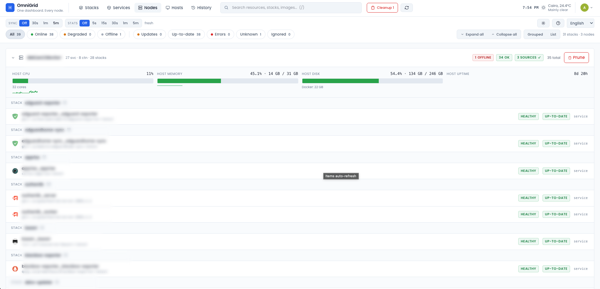
</p>

## Features

### Cluster updates & operations
- **Five views**: Stacks (grouped, default) · Services (flat sortable) · Nodes (per-host swarm grouping with HOST stats) · Hosts (curated inventory + telemetry) · History (audit log)
- **Digest-level update detection** — compares your running `image@sha256:...` against the remote manifest. Supports Docker Hub, GHCR, lscr.io, and any v2 registry. Token-cached www-authenticate dance for private registries.
- **Click-to-act** — Update Stack (prune+repull+redeploy), Recreate container, Restart service (no pull), Remove offline / orphan containers, all via the Portainer REST API.
- **Bulk operations** — checkbox multi-select; dedupes by stack so one stack = one update call.
- **Live operations panel** — streaming per-op event log floats bottom-right; auto-routes container ops to the correct Swarm worker via `X-PortainerAgent-Target`.
- **Ignore list** — pin certain images or stacks to skip (e.g. pinned `:v1.2.3` tags you don't want bumped).
- **Schedules** — cron-like recurring jobs (cache refresh / `docker system prune` per-node or fan-out / SQLite+avatars backup / asset-inventory refresh) with skip-if-running guards and audited history.

### Host telemetry & inventory
- **Curated host list** — operator-defined inventory under Admin → Hosts; each row maps to one or more provider-specific identifiers.
- **Four monitoring providers** (any combination): Beszel Hub (Pocketbase), Pulse (Proxmox), Prometheus node-exporter (Linux + FreeBSD), Webmin / Miniserv. Cross-provider fallback merges stats with a "most-specific wins" rule + per-host snapshots so a flaky agent doesn't blank the chart.
- **Time-series charts** — CPU / Memory / Disk usage / Disk I/O (Linux + FreeBSD `node_devstat_*`) / Network In/Out / Bandwidth / Load 1m/5m/15m / Swap, with 1h / 6h / 24h / 7d range picker and a live "Updated Xs ago" freshness label.
- **Host drawer detail** — hardware (vendor / model / serial / OS / kernel / arch), network interfaces, mounted filesystems, package-update count, systemd service status, optional asset-inventory join (model / serial / location from a third-party asset API).
- **Host groups** — operator-assigned `custom_number` ranges bucket curated hosts into collapsible sections (e.g. "Gateways 1-4", "VMs 100-199").

### Operations & access
- **Interactive SSH terminal** — admin-only xterm.js modal over WSS to a backend asyncssh PTY. PTY-forced (so sudo doesn't silently no-op), full audit row per session.
- **One-shot SSH runner** — admin-audited dry-run-by-default runner with destructive-pattern guard (typed-hostname confirm for `rm` / `dd` / `reboot` / etc.) and per-(host, user) 5-min cool-down on auth failure.
- **Audit log** — every operation (updates, restarts, ssh runs, schedule fires, backups) persisted to SQLite with full event log. Filterable + CSV / JSON export.
- **Backups** — DB + avatars snapshot zips via SQLite's online `.backup()` API. Browseable + restorable from the Admin → Backups page.
- **Apprise notifications** — success / failure push to your existing Apprise hub on every write op + scheduled-job completion. Master-toggle for ops-quiet windows.
- **Prometheus `/metrics`** — gather stats, op counts, cache age, host-stats provider health.

### Auth & UX
- **Local accounts** — username / password with bcrypt hashes, sliding 8h sessions, server-side revocation, rate-limited login (5 fails / 15 min / IP).
- **TOTP (2FA)** for local accounts — `pyotp` + Fernet-encrypted secrets at rest, QR enrolment, 10 single-use backup codes, admin-side master toggle + per-role required + per-user force flag, configurable failure lockout. Authentik users skip every TOTP path (Authentik handles MFA upstream).
- **API tokens** — admin-issued opaque tokens (SHA-256 at rest, raw token surfaced once on create) for machine clients. Tokens carry their own role; bearer-auth bypasses CSRF.
- **Authentik OIDC SSO** — Authorization-Code + PKCE flow, JWKS validation, group-based admin promotion, fully DB-backed config (no env vars).
- **Two roles**: `admin` (all ops) · `readonly` (reads only). Write routes enforce server-side; UI hides write buttons for read-only users.
- **CSRF** double-submit cookie, automatic on every cookie-authed write request.
- **Self-service** — change password, manage TOTP enrolment + backup codes, revoke own sessions, manage avatar / display name / email / bio, opt in/out of individual notification events.
- **Polish**: dark + light theme, English + Arabic with RTL support (more languages: drop a JSON in `static/i18n/`), global search (`/`), keyboard shortcuts (`?` for the cheat sheet), per-user view persistence.

### Deploy story
- **No Docker socket** — every Docker call goes through Portainer's REST API.
- **No image build** — uses `python:3.12-slim` with your code bind-mounted from `/opt/omnigrid/app`. Forgejo Actions pipeline rsyncs to the manager and force-updates the swarm service. Static-only changes ship without a service restart.
- **Self-healing** — Swarm `update_config: start-first, failure_action: rollback, monitor: 30s` so a failed deploy auto-rolls back (the same template OmniGrid recommends for services it manages).

## Architecture

```
┌───────────────┐       ┌──────────────┐       ┌──────────────┐
│   Browser     │──────▶│   OmniGrid   │──────▶│  Portainer   │
│ (Alpine+Tail) │  REST │   (FastAPI)  │  REST │   (Swarm)    │
└───────────────┘       └──────┬───────┘       └──────────────┘
                               │
                               │ HEAD /v2/*/manifests/<tag>
                               ▼
                    ┌──────────────────────┐
                    │  Docker registries   │
                    │ (hub, ghcr, lscr, …) │
                    └──────────────────────┘
```

- **`main.py`** — single-file FastAPI backend. Aggregates data from Portainer (services, tasks, nodes, stacks, containers), resolves remote digests in parallel, runs background update jobs, persists history/ignores/settings to SQLite, fires Apprise webhooks.
- **`static/index.html`** — single-page Alpine.js + Tailwind UI.
- **`/opt/omnigrid/data/omnigrid.db`** — SQLite for history, ignores, settings.

## Deploy

**1. Prep the host** (on the Swarm manager node):

```bash
sudo mkdir -p /opt/omnigrid/app /opt/omnigrid/data
sudo chown -R $USER:$USER /opt/omnigrid
```

**2. Copy the app files:**

```bash
scp main.py requirements.txt [email protected]:/opt/omnigrid/app/
scp -r static [email protected]:/opt/omnigrid/app/
```

**3. Create a Portainer API key**:
Portainer UI → profile menu → *My account* → *Access tokens* → add a new token. Give it admin scope (it needs to update any stack).

**4. Deploy the stack**:
Portainer → *Stacks* → *Add stack* → paste `docker-compose.yml`, fill in `PORTAINER_API_KEY` / `PORTAINER_URL` / `PORTAINER_ENDPOINT_ID` in the environment fields → Deploy.

**5. Point a reverse proxy at it (optional)**:
Any HTTPS-terminating proxy works — Nginx Proxy Manager, Traefik, Caddy, plain Nginx, etc. Forward `omnigrid.example.com` (or whatever hostname you publish under) → `http://<manager>:8088`. OmniGrid has its own local login + optional Authentik OIDC SSO, so the proxy doesn't need to do auth — just terminate TLS and forward. See [`docs/guidelines/authentik.md`](docs/guidelines/authentik.md) to wire up OIDC.

**6. Open it up**, hit ⚙️ Settings, configure:
- Apprise URL: e.g. `http://apprise.example.com:8005/notify/OmniGrid` (or with a tag)
- Portainer public URL: e.g. `https://portainer.example.com` (for the "Open in Portainer" deep links)

## How updates work

| Item type | What happens on click |
|---|---|
| Service in a Portainer stack | `PUT /api/stacks/{id}?endpointId={eid}` with `{Prune:true, PullImage:true}` — identical to Portainer UI's "Update the stack + re-pull + prune" |
| Standalone compose container | `POST /api/docker/{eid}/containers/{id}/recreate?PullImage=true` |
| Swarm service without a Portainer-managed stack | Update button disabled. Use Restart (ForceUpdate bump) or redeploy via CLI. |
| Restart action (drawer) | Bumps `TaskTemplate.ForceUpdate` and calls `POST /services/{id}/update` — same image, fresh tasks |

## Environment variables

| Var | Default | Notes |
|---|---|---|
**A fresh deploy can boot with NO env vars set** — bootstrap the first admin via `POST /api/local-auth/bootstrap`, then configure Portainer / OIDC / monitoring providers from the Settings UI. Everything below is either a first-boot seed (one-shot, ignored after the DB row exists) or a process-level tunable you can also override from Admin → Config.

| Var | Default | Notes |
|---|---|---|
| `PORTAINER_URL` | — | **Optional bootstrap.** Seeded into the DB on first boot; `Settings → Portainer` is authoritative after that. |
| `PORTAINER_API_KEY` | — | **Optional bootstrap** — same as above. Starts with `ptr_`. |
| `PORTAINER_ENDPOINT_ID` | `1` | **Optional bootstrap** — the Swarm endpoint id. |
| `VERIFY_TLS` | `true` | **Optional bootstrap** — stored as `portainer_verify_tls` in the DB after seeding. |
| `DB_PATH` | `/app/data/omnigrid.db` | SQLite location. |
| `DB_TYPE` | `sqlite` | DB backend. Currently `sqlite` only — scaffolding for future Postgres / MariaDB / Mongo backends. |
| `SESSION_SECRET` | auto-generated | HMAC key for session cookies. **Set explicitly in prod** — auto-generated means sessions die on every restart. |
| `BOOTSTRAP_ADMIN_USER` / `BOOTSTRAP_ADMIN_PASSWORD` | — | First-boot-only admin seed. Consulted when the users table is empty; ignored after that. Blank both values in a follow-up commit once you've logged in. |
| `ENV_FILE_PATH` | `/app/.env` | Where `python-dotenv` looks for env values at startup. |
| `DOCKERHUB_USER` / `DOCKERHUB_TOKEN` | — | Optional. Bypass anonymous Docker Hub rate limits. |

**Process-level tunables** (DB > env > default — live UI override at `Admin → Config`):

| Var | Default | Notes |
|---|---|---|
| `CACHE_TTL_SECONDS` | `900` | Items cache TTL (full registry-digest refresh interval). |
| `STATS_CACHE_TTL_SECONDS` | `30` | Per-container stats cache TTL — fresh polling without forcing a full digest re-fetch. |
| `REGISTRY_CONCURRENCY` | `8` | Parallel remote-digest fetches. |
| `STATS_CONCURRENCY` | `16` | Parallel `/containers/{id}/stats` calls. |
| `STATS_HISTORY_DAYS` | `7` | Retention window for the time-series tables (`stats_samples` / `host_metrics_samples` / `host_net_samples`). |
| `STATS_SAMPLE_INTERVAL_SECONDS` | `300` | How often the lifespan samplers snapshot into the time-series tables. |

OIDC has **no env vars** — every OIDC setting (issuer URL, client ID / secret, redirect URI, scopes, admin group, enable toggle) lives in the DB `settings` table and is edited from `Settings → Authentik OIDC`. See [`docs/guidelines/env_example.md`](docs/guidelines/env_example.md) for the full reference and [`docs/guidelines/authentik.md`](docs/guidelines/authentik.md) for the Authentik-side walkthrough.

## API (if you want to script it)

Every `/api/*` route requires authentication (401 otherwise) — except `/api/healthz`, `/api/version`, and `/metrics`. Two auth modes:

- **Bearer API token** (preferred for scripts): `Authorization: Bearer og_<token>`. Issue from `Admin → API tokens`. Tokens carry their own role (`admin` / `readonly`); bearer requests bypass CSRF.
- **Cookie session** (browser): `og_session` HMAC-signed cookie + `og_csrf` double-submit on every write.

```
# Cluster overview & operations
GET    /api/items                          all services + containers + stacks with status
GET    /api/stats                          live CPU / memory / size per item
GET    /api/stats/history                  per-item time-series (sparklines)
POST   /api/update/stack/{id}              prune+repull+redeploy   → {op_id}
POST   /api/update/container/{id}          recreate w/ pull        → {op_id}
POST   /api/restart/service/{id}           ForceUpdate bump        → {op_id}
POST   /api/restart/container/{id}                                  → {op_id}
POST   /api/remove/container/{id}          delete -fv              → {op_id}

# Operations panel & history
GET    /api/ops                            list active+recent ops (in-memory, last 50)
GET    /api/ops/{op_id}                    single op + event log
GET    /api/history?limit=100&search=...   persisted completed ops (filterable)
DELETE /api/history                        clear history (admin)

# Hosts (curated inventory + telemetry)
GET    /api/hosts/list                     skeleton list (fast, no per-host probes)
GET    /api/hosts/one/{host_id}            single curated host merged with provider data
GET    /api/hosts/history?system_id=...&host_id=...&hours=...   per-host time-series; system_id (Beszel) OR host_id (NE-only)
GET / POST                   /api/hosts/config                   list / replace `hosts_config`
GET                          /api/hosts/discover                 probe each provider for available host names
POST                         /api/hosts/test                     per-row validation (provider names + URLs)

# Auth / users / sessions / tokens / TOTP
POST   /api/local-auth/login               username + password → og_session OR {totp_required, challenge_token}
POST   /api/local-auth/totp                 6-digit TOTP code OR 8-char backup code → og_session
POST   /api/local-auth/totp-setup-confirm   first-login forced-enrol path (combined enrol+verify)
POST   /api/local-auth/logout
POST   /api/local-auth/change-password
POST   /api/local-auth/bootstrap           one-shot first-admin seed
GET    /api/oidc/login                     starts the Authorization-Code+PKCE flow
GET    /api/oidc/callback
GET    /api/me                             current identity (auth-optional; includes notify-prefs + bootstrap_env_still_set warning)
GET / PATCH                  /api/me/{ui-prefs,notify-prefs,profile}    self-service profile + per-user notify opt-in/out
GET                          /api/me/totp
POST                         /api/me/totp/{enroll-start,enroll-confirm,regenerate-codes,disable}
GET / POST / PATCH / DELETE  /api/users[/{id}]
POST                         /api/users/{id}/{reset-password,disable-totp,totp-force}
GET / DELETE                  /api/sessions[/{token_id}]
GET / POST / DELETE          /api/tokens[/{id}]

# Settings & integrations (admin)
GET    /api/settings
POST   /api/settings                       additive — null = keep current
POST   /api/portainer/test                 probe Portainer + verify endpoint id (#360)
POST   /api/beszel/test
POST   /api/pulse/test
POST   /api/webmin/test
POST   /api/oidc/test                      probe issuer's discovery endpoint
POST   /api/notify-test                    fire a test Apprise ping

# Schedules / backups / SSH
GET / POST / PATCH / DELETE  /api/schedules[/{id}]
POST                          /api/schedules/{id}/run     fire immediately → {op_id}
GET                           /api/schedules/queue?limit=50
GET / POST / DELETE          /api/backups[/{name}]   create / list / remove
POST                          /api/backups/{name}/restore
GET                          /api/hosts/{id}/ssh/status
POST                          /api/hosts/{id}/ssh/test
POST                          /api/hosts/{id}/ssh/run    body: {command, dry_run}
WS                            /api/hosts/{id}/ssh/terminal   interactive xterm (WebSocket; cookie auth only — bearer not supported via stock browser WS APIs)

# Asset inventory
GET                           /api/asset-inventory                   serve cached asset list
POST                          /api/asset-inventory/test              probe asset-API token
POST                          /api/asset-inventory/refresh           force a full reload

# Health / metrics / version
GET    /api/healthz                        always 200 if alive
GET    /api/version                        {version}
GET    /api/admin/version                  admin-only — current MAJOR/MINOR/PATCH for the editor
POST   /api/admin/version                  admin-only — write VERSION.txt directly
GET    /metrics                            Prometheus exposition (no auth)
```

Full schema for each endpoint lives in `main.py` — every route is decorated with FastAPI type hints and most have docstrings explaining the contract.

## Limitations

- **External stacks** (deployed via `docker stack deploy` CLI and then "discovered" by Portainer) have no compose file stored in Portainer → stack update returns HTTP 400. The Update button is disabled and the detail drawer explains this. Workaround: redeploy via CLI or use the Restart (no-pull) action.
- **No live Docker events.** The ops panel polls the in-memory event log at 1.5s intervals — good enough for the "kicked off → succeeded / failed" loop, but not a real-time `docker events` stream.
- **Single-replica only.** State (live ops dict, gather cache, host-stats cache) lives in-memory inside one process. Running multiple replicas would split this state across replicas; the compose placement constraint pins the service to a single manager node by default. Lifespan-managed background tasks (samplers, scheduler, drift watcher) follow the same single-replica invariant.
- **SQLite-backed only (today).** The `DB_TYPE` env var scaffolds multi-database support but only `sqlite` is wired up. Postgres / MariaDB / MongoDB are tracked in the TODO ([#354 / #355 / #356](notes/note_todo.txt)) for when an operator with an existing managed DB asks for it.
- **Worker-node container ops require Portainer Edge agent.** Container-level write ops (recreate / restart / remove) are routed via `X-PortainerAgent-Target: <hostname>` so Portainer talks to the right Docker daemon. Stack and service ops use Portainer's Swarm-aware endpoints and don't need this.
- **Time-series retention is bounded.** `STATS_HISTORY_DAYS` defaults to 7. Charts stop having data beyond that window. Bump the env var or push the data to a downstream Prometheus / VictoriaMetrics if you need long-term retention.
- **Asset-inventory integration is operator-supplied.** OmniGrid joins host rows against an external asset API (model / serial / location). The API contract is documented in [`docs/guidelines/api_services.md`](docs/guidelines/api_services.md); without it the asset card simply doesn't render.

## Updating OmniGrid itself

Because the code is bind-mounted from `/opt/omnigrid/app`, you just:

```bash
# overwrite the files on the host
scp main.py static/index.html [email protected]:/opt/omnigrid/app/...

# redeploy the single service (no full stack update needed)
docker service update --force omnigrid_omnigrid
```

Or, of course, use OmniGrid itself to update… itself. Fun thought.

## Documentation

- [`docs/README.md`](docs/README.md) — index of operator runbooks (auth, OIDC,
  deploy, env reference, scheduler, metrics, npm updates, Beszel agent setup).
- [`CHANGELOG.md`](CHANGELOG.md) — release notes per Keep a Changelog (root
  per convention so git hosts and packagers auto-detect it).
- [`docs/RELEASE_PROCESS.md`](docs/RELEASE_PROCESS.md) — SemVer cadence,
  PATCH auto-bump on deploy, periodic MINOR cuts, MAJOR breaking-change ritual.

## Screenshots

The Nodes view at the top of this README is the dashboard's most-used surface.
The full gallery lives under [`docs/screenshots/`](docs/screenshots/) — a quick
tour:

### Cluster overview

| | |
| --- | --- |
| 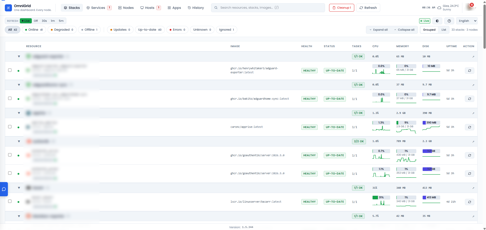 | **Stacks view** — grouped table, expand-per-stack, the default landing surface. |
| 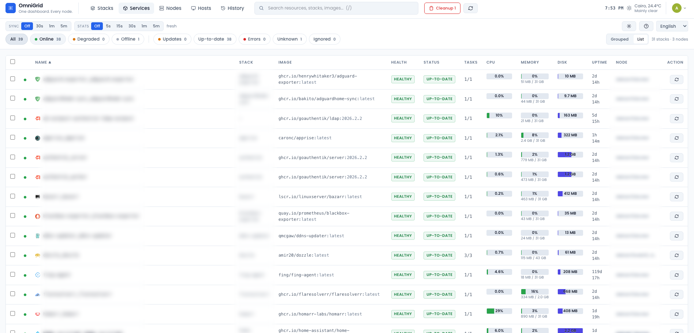 | **Services view** — flat sortable list of every Swarm service. |
| 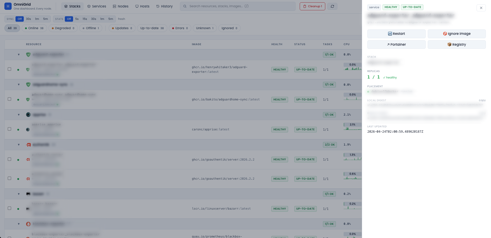 | **Service detail drawer** — image / digest / actions (Restart / Recreate / Ignore). |
|  | **Nodes view** — stacks grouped by Swarm node with live HOST CPU / MEM / DISK / UPTIME bars. |
| 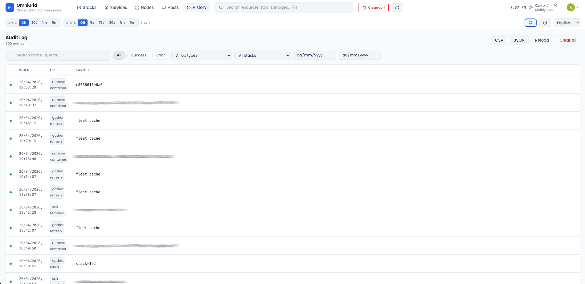 | **History (audit log)** — every operation persisted with filterable when / op / target columns. |

### Hosts

| | |
| --- | --- |
| 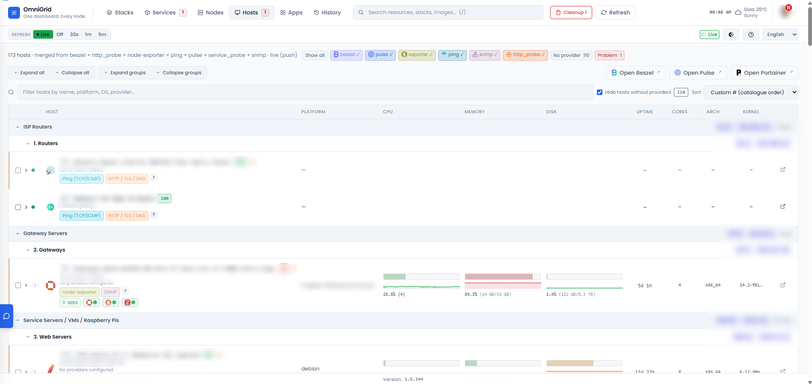 | **Hosts view (light)** — curated host inventory grouped by `custom_number` ranges. |
| 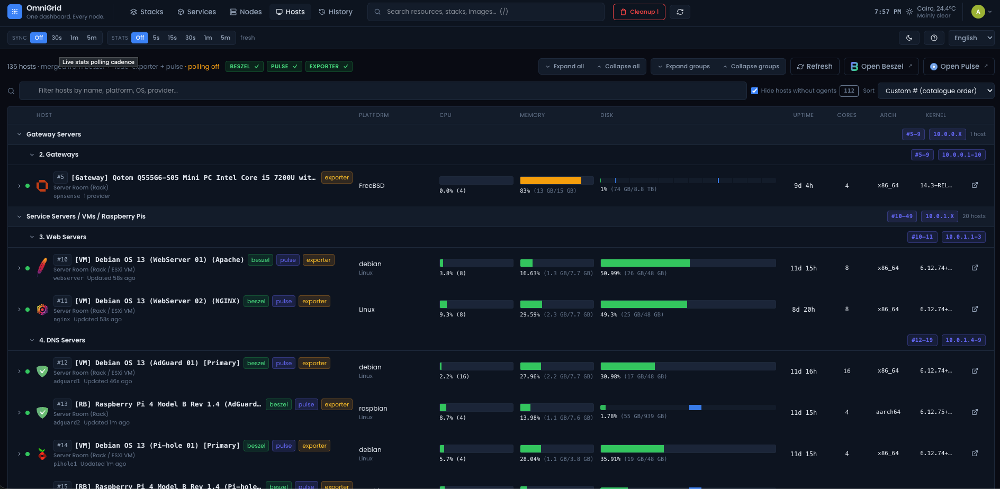 | **Hosts view (dark)** — same data, dark theme. |
| 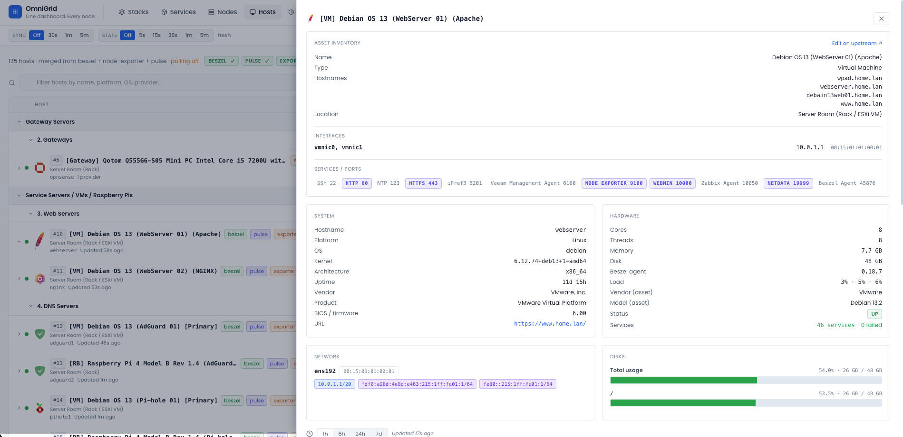 | **Host drawer — hardware** — vendor / model / serial / OS / kernel / network details. |
| 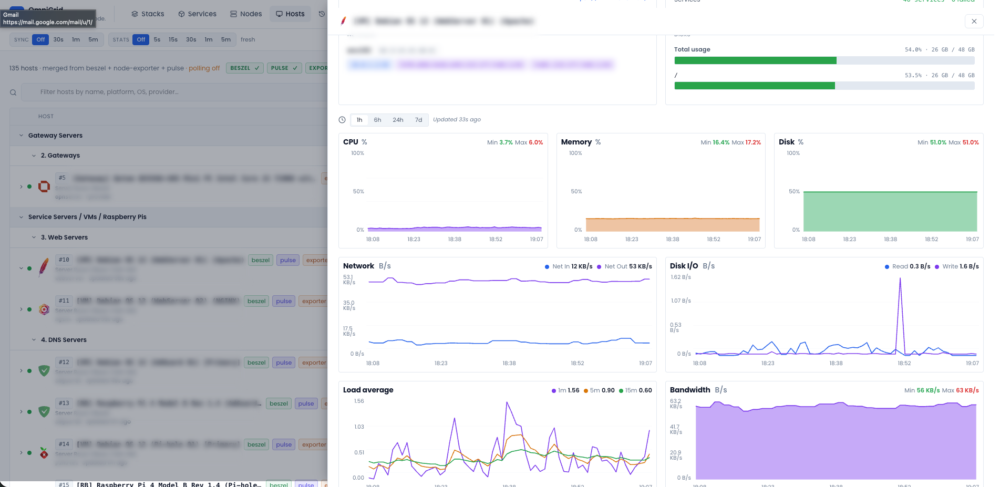 | **Host drawer — charts** — CPU / Mem / Disk / Net In/Out / Load / Bandwidth time-series. |
| 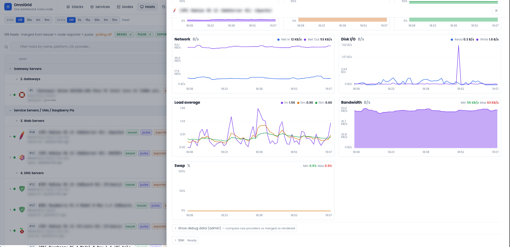 | **Host drawer — bandwidth + swap** — scrolled view of the chart grid. |

### Admin / operations

| | |
| --- | --- |
| 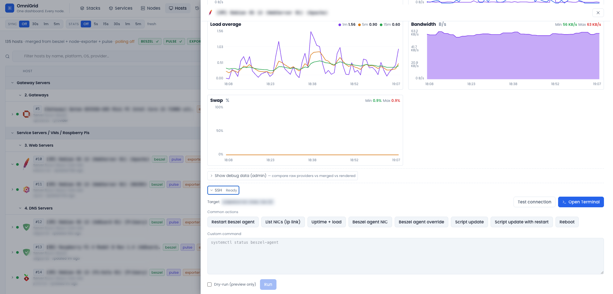 | **Host drawer — SSH-run** — admin one-shot command runner with dry-run, destructive-pattern guard, full audit. |
| 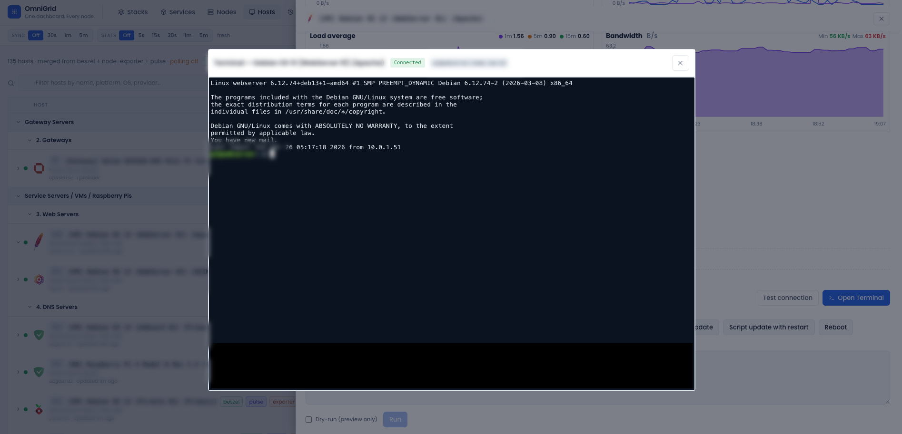 | **Host drawer — SSH terminal** — interactive xterm.js session via WSS to the backend's asyncssh PTY. |
| 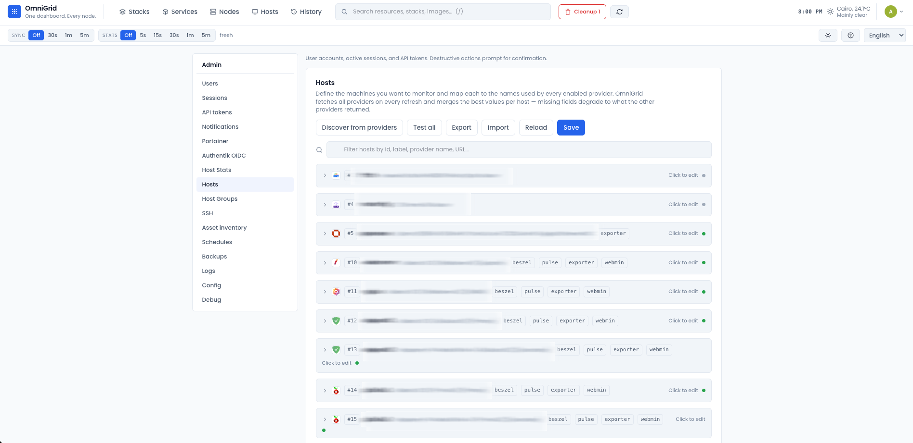 | **Admin → Hosts editor** — paginated curated-host CRUD with live discovery from each provider. |
| 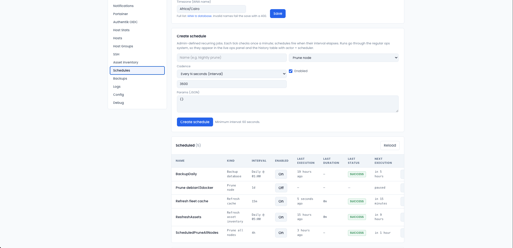 | **Admin → Schedules** — cron-like recurring jobs (gather refresh / prune / backup / asset refresh). |
| 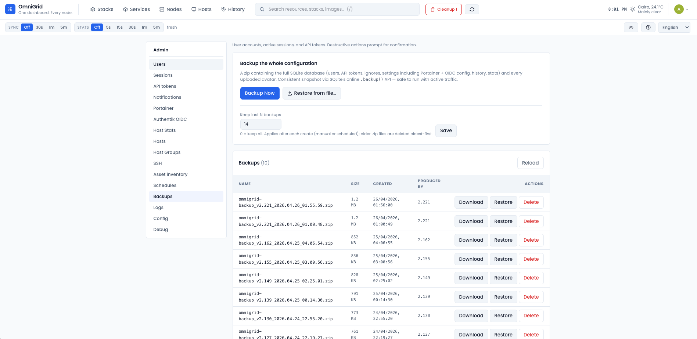 | **Admin → Backups** — DB + avatars snapshot zips with download / restore. |
| 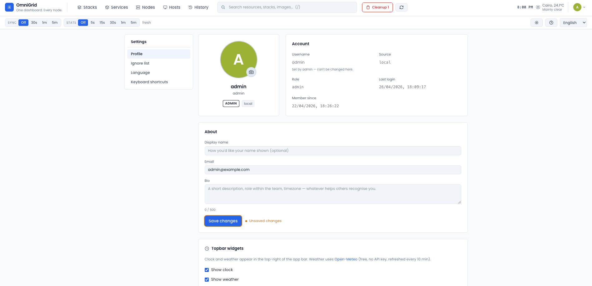 | **Settings → Profile** — account info, display name / email / avatar, password change. |
| 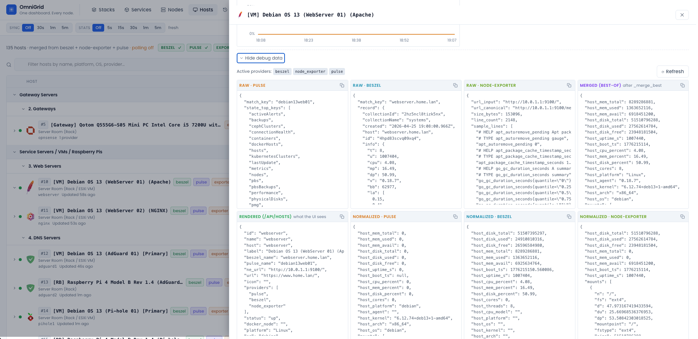 | **Host drawer — debug** — raw provider-payload view (Beszel / Pulse / NE / Webmin) for troubleshooting empty rows. |
